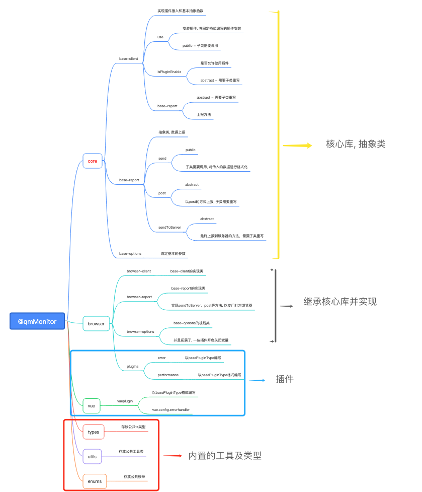

# web-monitor-sdk

## 背景

 - 传统模式下，一个前端项目发到正式环境后，所有报错信息只能通过用户使用时截图、口头描述发送到开发者，然后开发者来根据用户所描述的场景去模拟这个错误的产生，这效率肯定超级低
 - 所以很多开源或收费的前端监控平台就应运而生，比如:

* [sentry](https://github.com/getsentry/sentry)
* [webfunny](https://github.com/a597873885/webfunny_monitor)
* [fundebug](https://www.fundebug.com/)
* [阿里云前端监控(ARMS)](https://www.aliyun.com/product/arms)

等等一些优秀的监控平台

### 为什么要自研
1. 大部分好的前端监控平台都要收费
2. 可以根据自己的业务, 进行专门收集

## 监控系统的组成

从上图可以看出来，如果需要自研监控平台需要做三个部分：
1. APP监控SDK：收集错误信息并上报
2. server端：接收错误信息，处理数据并分析存入数据库，而后根据告警规则通知对应的开发人员
3. 可视化平台：从数据存储引擎拿出相关信息进行渲染，用于快速定位问题

## SDK

### 简介
qm-web-monitor-sdk: 是一套前端监控sdk, 包括收集
1. api数据: fetch、xhr
2. 错误数据: JS、resource、console.error、promise、vue、react
3. 性能数据: FP、FCP、FMP、navigator、resource、FID、LCP、CLS
4. 自定义埋点上报
5. 用户行为数据: click、hash-router、history-router、pv
6. wx小程序支持(开发中)

### 老版本
`v1`版本请看 [web-monitor-sdk](https://github.com/Little-LittleProgrammer/web-monitor-sdk)

### 架构
> 借鉴了 vue3 和 mitojs 的代码

#### monorepo

**什么是 monorepo**
monorepo: (管理项目代码的一个方式，指在一个项目仓库 (repo) 中管理多个模块/包 (package)，不同于常见的每个模块建一个 repo).

优秀的monorepo应该具备: 依赖管理能力(pnpm)、任务编排能力(monorepo)、版本发布能力(自写rollup脚本)

目前大型的开源库:
    vue3、react、sentry、vite、nuxt、element-plus等等 都使用了monorepo的方式开发

monorepo的优势:
1. 可分模块打包、分模块发布(提高开发体验)
2. 代码结构清晰(降低耦合性，提高代码可读性)
3. 方便之引入需要使用的模块
4. 核心功能抽离, 封装 抽象类, 具体模块使用时继承(提高开发效率)
5. 方便后续扩展

#### 整体架构
[结构](https://note.youdao.com/ynoteshare/index.html?id=ea83e34312588f5cde7af9931c0d68db&type=note&_time=1659345675077)


架构思路: 
1. 主次关系:
    - 主要目录: 不同端(例如: 浏览器、wx小程序)这种拥有明显不同API的端
    - 次要: 每个功能, 针对每个端的插件, 要使用的功能
    - 以这种思路设计目录: browser - plugins - errorPlugin | wxMini - plugins - xxx
2. 工具库、类型库、枚举库为 辅助工具库
3. 核心库为主要被继承的祖父库, 以核心库衍生不同端的业务功能

> 疑问解答
> 1. 为何要如此设计
    - 设计初, 有两种设计方式: 
        1. 以插件(例如错误收集)为主要, 针对此插件开发不同端的适配(例如: 目录结构: `errorPlugin - (browser | wxMini ) `)
        2. 第二种就是目前采用的方式, 原因: 
            - 端-插件, 以大到小的格式比较符合逻辑, 后续还方便扩展, 不至于每次加一个插件, 各个端都开发完好才可以上线
            - 目前主流或者开源的库都是这种思路
    - 
> 2. 为何core中, 一部分为公共方法, 一部分为抽象方法
    - public 就是: 针对不同的端,都公用的方法, 比如 
        - `use`方法安装插件, 
        - `sendTime`方法是否缓存上传, 这些针对所有端, 都必须且不必特殊开发的方法
    - abstract 就是: 不同端, 可能有不同的实现方式, 比如 
        - `isPluginEnable`方法, 不同端的插件肯定不同; 
        - `post`方法: `browser`使用`xhr`, `wx小程序`使用`wx.request`

### plugin插件

采用了 发布-订阅观察者设计模式 以便后续迭代功能

例如 vue 的 vuex, vurRouter, 或者是UI框架, 都相当于插件形式接入vue的

```js
 watch 订阅消息
 notify 发布消息, 消息一发布, watch就能接收到并上报
```

**优势:**
1. 可以自定义引入插件,降低项目引入包体积
2. 黑盒模式, 开发人员无需知道代码实现逻辑, 只需按照已定的插件格式进行开发插件,方便拓展 - 主要
    - 例如 vue的插件, 插件人员开发的时候, 如果是需要去读vue源码才能去开发, 那岂不是效率很低


**插件的思路**


**栗子**

console-error监听

```js

const consoleErrorPlugin: BasePluginType<BrowserErrorTypes, BrowserClient> = {
    name: BrowserErrorTypes.CE,
    monitor(notify) { // 观察者模式, 
        (_global as unknown as Window & typeof globalThis).console.error = (...args: any[]) => {
            notify(BrowserErrorTypes.CE, args); // 将一阶段处理结果通过notify进行订阅
        };
    },
    transform(args: any[]) { // 参数格式转化,得到 最终格式的 上传数据
        const _reportData:ReportErrorData = {
            type: 'error',
            subType: BrowserErrorTypes.CE,
            pageURL: getPageUrl(),
            mainData: {
                type: '',
                errorUid: getErrorUid(`console-error-${args[0]}`),
                msg: args.join(';'),
                meta: undefined,
                stackTrace: undefined
            }
        };
        return _reportData;
    },
    consumer(reportData: ReportErrorData) { // use 中 watch 进行消息发布, 观察者模式消费者进行消费
        this.report.send(reportData, true);
    }
};
```

### 自定义上报
> 用于自定义埋点上报

正常情况下, 都是插件已经定好模式进行数据监听, 监听到然后上报, 无法自定义的针对所需业务进行上报. 所以`SDK`就必须提供一个全局函数供使用者进行调用

**api**
```js
export interface ReportData {
    type: string; // 信息类型
    subType: string// 信息副类型
    pageURL: string; // 上报页面
    startTime?: number; // 上报时间
    mainData: Record<string, any>
}

log(data: ReportData, isImmediate)
```

**栗子**
```js
// main.js
import {init} from '@qmonitor/browser'
import {vuePlugin} from '@qmonitor/vue'

const {log} = init({
    url: 'xxx',
    appID: 'xxx'
}, [vuePlugin])

vue.prototype.$log = log
```

```js
// x.vue
<a @click = "log"> </a>
...
methods: {
    log() {
        this.$log({
            type: 'log',
            mainData: {
                msg: '自定义上报'
            }
        }, true)
    }
 }

```

### 数据上报
- 用户id
    - 用SDK生成，在每次上报之前都判断localstorage是否存在userID，有则获取，没有的话生成一个并设置到localstorage
- 上报方法
    - sendBeacon(主要用于将统计数据发送到 Web 服务器)
    - axios
    - image 方式, 可通过配置开启, 只在(browser中生效)
- 上报时机
    - 缓存上报数据，集齐目标个数(个数可在配置项配置)上传, 存入本地缓存并加密, 上报时解密上报
    - 页面隐藏与关闭的前夕上报数据
    - 不能阻塞项目：
        - 不能使用异步：防止页面关闭或刷新时通讯被浏览器cancel
        - 使用 `requestIdleCallback/setTimeout` 延时上报
- 上报数据
    - 过滤重复的数据
        - 每分上报数据拥有独立的id, 当id重复时, 不记录上报数据  
- 上报格式
```js
interface ReportData{
    sdkName: string, // sdk名称
    sdkVersion: string, // sdk版本
    id: string; // uuid, 本次上报的会话id
    appID: string; // 项目id
    appName?: string; // 项目名称
    userID?: string; // 用户ID
    networkInfo?:Record<string, any>; // 网络信息
    data: {
        type:  'performance' | 'error' | 'behavior'; // 信息类型
        subType: string; // 信息副类型
        pageURL: stirng; // 上报页面
        time?: number; // 上报时间
        mainData: Record<string, any>; // 针对 某一项类型中的具体数据
    }[]
}
```

### rollup 打包

相比于webpack, rollup更小巧, 适合于打包库文件. webpack结合插件可以完成前端工程化的绝大多数工作，而Rollup仅仅是一款ESM打包器，没有其他功能

**打包结果**

一般的js库项目, 都必须打包为三种格式
- cjs: 适用于 `require('xxx')`格式的项目
- esm: 适用于 `import xxx from xxx`格式的项目
- iife: 适用于通过 `script 或者 link` 的hmtl文件直接引入的项目

通过 package.json的 配置去配置什么时候该引入哪个文件

1. 借鉴了 vue2 的打包思路, 对于不同环境下(`production, development`)使用不同的打包结果
2. 接受变量, 以分目录打包
`npm run build browser`
3. 接受变量, 也可以分模块发布
`npm run release browser`
4. 可以统一更改每个模块的版本
`npm run version 3.0.0`

### 例子

请看`example`文件夹

## 总结
### SDK 大致流程
订阅事件 =》监听或者重写原生时间 =》触发事件(发布事件) =》 拿到上报信息 =》 判断是否立即上报 =》 缓存或上报服务端

